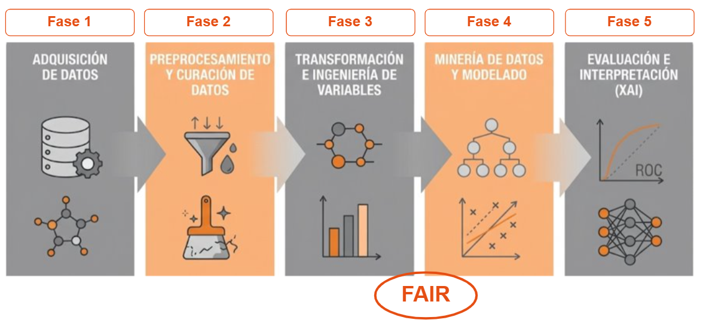
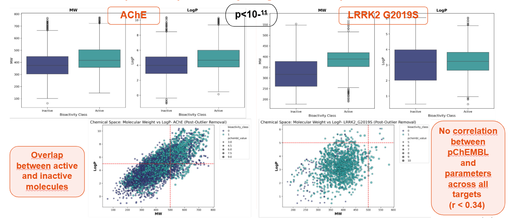
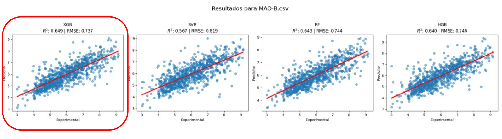

# Machine Learning for drug discovery in neurodegenerative diseases

Predicting molecular bioactivity against four key neurodegenerative proteins using a dual classification and regression machine learning pipeline. Built entirely from raw ChEMBL data and structured under KDD process, leverages RDKit and PaDEL-Descriptor for molecular featurization, with explainable AI (XAI) to extract interpretable pharmacophore rules.


> ℹ️ **Academic Baseline & Codebase Notice**  
> The original, unedited codebase evaluated during the Master's Thesis defense is preserved and archived at [Release v1.0.0 - Official Master's Thesis Academic Baseline](https://github.com/carladdm/ML-Drug-Discovery-Neuro/releases/tag/v1.0-master-thesis).  
> The `main` branch maintains a modularized, containerized Python package (`src/`) following Data Science standards, designed for scalable multi-target bioactivity screening and reproducible execution.

---

## 📌 Executive Overview & Problem Statement

### Situation
Neurodegenerative conditions such as Alzheimer's and Parkinson's disease currently affect over 55 million people worldwide without disease-modifying therapies. Early computational pre-screening of candidate molecules across enzymatic targets is critical to avoid multi-million-dollar wet-lab assay failures. This project addresses four validated targets:
* **AChE** (Acetylcholinesterase) & **GSK-3β** (Glycogen Synthase Kinase-3β) — Key drivers in Alzheimer's disease.
* **MAO-B** (Monoamine Oxidase B) & **LRRK2** (Leucine-Rich Repeat Kinase 2; Wild-Type & G2019S mutation) — Central drivers in Parkinson's disease.

### Task & Value Proposition
Design, refactor, and deploy an end-to-end Machine Learning pipeline structured under the **Knowledge Discovery in Databases (KDD)** framework. The system automates raw data extraction from **ChEMBL v36** (15,456 curated compounds), performs molecular featurization (881-bit PubChem Fingerprints via PaDEL and Lipinski RDKit descriptors), executes dual-stage optimization (LazyPredict screening → Optuna Bayesian Tuning), and extracts interpretable pharmacophoric rules via Explainable AI (SHAP TreeExplainer).

---

## 📊 Key Results & Empirical Benchmark

### 1. Regression — Potency Prediction (pChEMBL value, derived from IC₅₀)
*Evaluated on held-out test sets (80/20 split) post-Optuna Bayesian Hyperparameter Optimization.*

*All models reported are the **Optuna-optimized** final winners after two-stage selection (LazyPredict screening → Bayesian hyperparameter tuning).*

| Target | Final model | Test R² | Test RMSE |
|---|---|---|---|
| AChE | XGBoost | **0.711** | **0.719** |
| GSK-3β | XGBoost | **0.676** | **0.719** |
| MAO-B | XGBoost | **0.649** | **0.737** |
| LRRK2 unified | XGBoost | **0.673** | **0.608** |
| LRRK2 WT | XGBoost | **0.571** | **0.601** |
| LRRK2 G2019S | RF / XGBoost | **0.638** | **0.649** |

> *$R^2 > 0.60$ on independent test sets is considered highly competitive in computational medicinal chemistry due to inherent bioassay noise.*

#### 📈 Optimization Impact: Default Baseline vs. Optuna Bayesian Search
A critical phase of the ML engineering pipeline was the systematic tuning of top-performing baseline models using **Optuna (Tree-structured Parzen Estimator - TPE)** across 30 trials with stratified 5-fold cross-validation. 

Hyperparameter optimization unlocked substantial performance improvements across all neurodegenerative targets compared to default baseline regressors:

| Target | Target ChEMBL ID | Baseline Model (LazyPredict) | Baseline $R^2$ | Final Model (Post-Optuna) | Final $R^2$ | **Optimization Gain ($\Delta R^2$)** | Final Test RMSE |
| :--- | :--- | :---: | :---: | :---: | :---: | :---: | :---: |
| **AChE** | `CHEMBL220` | XGBoost | 0.670 | **XGBoost** | **0.711** | **+6.12%** | **0.719** |
| **MAO-B** | `CHEMBL203` | Random Forest | 0.570 | **XGBoost / RF** | **0.643** | **+12.81%** | **0.744** |
| **GSK-3β** | `CHEMBL262` | HistGradientBoosting | 0.630 | **HistGradientBoosting** | **0.670** | **+6.35%** | **0.726** |
| **LRRK2 Unified** | `CHEMBL1908209` | SVR | 0.620 | **XGBoost / SVR** | **0.653** | **+4.60%** | **0.626** |
| **LRRK2 G2019S** | `CHEMBL1908209` | Random Forest | 0.600 | **Random Forest** | **0.638** | **+6.33%** | **0.649** |

> 💡 **Key Engineering Takeaway:** Automated Bayesian hyperparameter search unlocked up to a **+12.81% increase in variance explained ($R^2$)** for challenging targets like MAO-B, proving the necessity of systematic tuning over naive default parameter selection.
> 
### 2. Classification — Active / Inactive Screening Filter
*Binary threshold: Active ($pIC_{50} \ge 6.0$, $IC_{50} \le 1\mu M$) vs. Inactive ($pIC_{50} \lt 6.0$). MCC is reported as the primary metric due to class imbalance.*

| Target | Best model | MCC | AUC-ROC |
|---|---|---|---|
| AChE | XGBoost | **0.65** | **0.90** |
| GSK-3β | LGBM | **0.69** | **0.91** |
| MAO-B | RF | **0.62** | **0.89** |
| LRRK2 unified | LGBM | **0.46** | **0.89** |
| LRRK2 WT | LGBM | **0.47** | **0.85** |
| LRRK2 G2019S | LDA / Passive Agressive | **0.52** | **0.85** |

---

## 🛠️ Tech Stack & Engineering Environment

* **Core Language & Runtime:** Python 3.12
* **Chemoinformatics:** RDKit (`2026.03.1`), PaDEL-Descriptor (`padelpy 0.1.16`), ChEMBL Web Resource Client (`0.10.9`)
* **Machine Learning & Tuning:** Scikit-Learn (`1.6.1`), LazyPredict, LightGBM, XGBoost, Optuna (`4.9.0`), 
* **Explainable AI (XAI):** SHAP (`0.52.0` TreeExplainer)
* **Infrastructure & Automation:** Docker (Debian Slim + Java OpenJDK 17 + C-libs), Makefile, Pathlib

---

## 📂 Production Repository Structure

```text
ML-Drug-Discovery-Neuro/
├── .gitignore               
├── Dockerfile               
├── Makefile                 
├── README.md                
├── requirements.txt         
│
├── data/                    
│   ├── raw/                 # Raw REST API extractions from ChEMBL v36
│   ├── processed/           # Curated pIC50 matrices & 881-bit PubChem fingerprint matrices
│   └── external/
│
├── models/                  
│   └── .gitkeep
│
├── notebooks/               # Exploratory research phase notebooks
│   ├── ML_DD_Neuro_01_Data_Acquisition_and_Filtering.ipynb
│   ├── ML_DD_Neuro_02_Bioactivity_Data_Preprocessing.ipynb
│   ├── ML_DD_Neuro_03_Lipinski_and_Exploratory_Data_Analysis.ipynb
│   ├── ML_DD_Neuro_04_Descriptor_Dataset_Preparation_v2.ipynb
│   ├── ML_DD_Neuro_05_Compare_Supervised_Models.ipynb
│   ├── ML_DD_Neuro_06_Classification_Models_Optimisation.ipynb
│   ├── ML_DD_Neuro_07_Regression_Models_Optimisation_v2.ipynb
│   └── ML_DD_Neuro_08_Regression_Models_Opt_XAI.ipynb
│
├── reports/
│   └── figures/              # Metric plots, ROC curves, and SHAP summaries
│
└── src/                      # Production-ready Python Package
    ├── __init__.py
    ├── config.py             # Pathlib dynamic routing & multi-target configurations
    ├── dataset.py            # Automated ChEMBL API ingestion & pIC50 transformations
    ├── features.py           # Lipinski descriptors & PubChem featurization via RDKit
    └── modeling/
        ├── __init__.py
        ├── train.py          # Dual training workflows (Classification & Regression)
        └── predict.py        # Inference engine on new SMILES candidates
```
---

## 🔬 Methodology & KDD Workflow

The repository implements an end-to-end Machine Learning pipeline structured under the **Knowledge Discovery in Databases (KDD)** framework, moving seamlessly from raw REST API extraction to interpretable pharmacophoric decision rules.

<p align="center">
  
</p>

```text
ChEMBL v36 REST API ──> Data Ingestion & Curation ──> Molecular Featurization ──> Optuna Tuning ──> SHAP XAI Rules
   (15,456 Compounds)     (Z-score / Outlier filtering)  (881-bit Fingerprints)   (Four Models)    (Pharmacophore SAR)
```
---

---

## 📊 Key Results & Empirical Benchmark

### 1. Chemical Space Analysis & Feature Engineering
Before model training, molecular distribution was evaluated against Lipinski's Rule of 5 (MW vs LogP). The significant overlap between active and inactive classes confirmed that simple physicochemical properties are insufficient for bioactivity separation, justifying 881-bit PubChem topological fingerprint featurization.

<p align="center">
  
</p>

### 2. Model Performance (Predicted vs. Experimental Potency)
Post-Optuna Bayesian hyperparameter optimization, ensemble models (XGBoost, Random Forest, HGB) and SVR achieved strong predictive capacity across test sets.

<p align="center">
  
</p>

---

## 🧠 Explainable AI (XAI) & Pharmacophore Discovery

To bridge machine learning predictions with medicinal chemistry insight, **SHAP TreeExplainer** was applied to extract feature contributions from high-performing ensemble models. This converts black-box predictions into interpretable pharmacophoric rules by identifying specific PubChem fingerprint bits that drive bioactivity.

<!--<p align="center">
<!--  
<!--</p>

<!--  -->

---

## 🚀 Getting Started & Execution Guide

### Option A: Local Virtual Environment via Makefile (Recommended)

```bash
# 1. Clone repository
git clone [https://github.com/carladdm/ML-Drug-Discovery-Neuro.git](https://github.com/carladdm/ML-Drug-Discovery-Neuro.git)
cd ML-Drug-Discovery-Neuro

# 2. Automated environment setup (Creates .venv & installs pinned dependencies)
make setup

# 3. Execute modular pipeline
make train
```
### Option A: Local Virtual Environment via Makefile (Recommended)

```bash
# 1. Build production image (Python 3.12 + OpenJDK 17)
make docker-build

# 2. Run containerized training with mounted volumes
make docker-run
```
---

## 👤 Author & Maintainer

Carla Di Monno (carladdm) — Data Scientist | Chemical Engineer
MSc in Big Data & Data Science (Distinction in Machine Learning).

[LinkedIn](https://www.linkedin.com/in/ing-carladimonno)